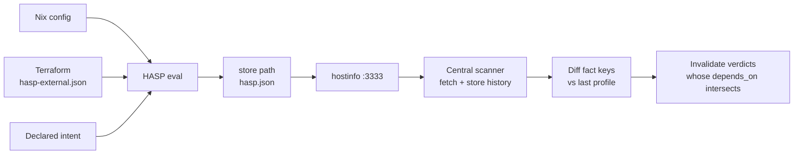

# HASP Framework

**Host Attack Surface Profile — the static fact set that drives CVE triage**

Status: design for review. Not implemented.
Consumed by: [Vulnix CVE Automation](vulnix-cve-automation.md).

---

## 1. What a HASP is

A HASP is a **static, per-host attribute set describing how the machine is
exposed**, evaluated from the NixOS configuration at build time, living on the
host, and served as `hasp.json` on port 3333 alongside the existing hostinfo
documents.

It answers one question, and only this question:

> Given that this package is vulnerable, what about *this machine* makes that
> matter, or not matter?

It is a set of facts. It contains no CVEs, no verdicts, no scores, and no prose.
Every consumer that needs to explain a decision cites facts from here by key.

### What it is not

| Not | Because |
|---|---|
| A vulnerability report | It knows nothing about CVEs; the scan does that |
| A triage record | Verdicts live in git as VEX, and reference HASP by version |
| LLM-written or LLM-modified | Every value is derived, declared by a named person, or injected by Terraform. Nothing in a HASP is generated prose |
| A runtime document | It changes when the machine's configuration changes, not when processes come and go |
| An inventory of packages | See rule 2 below. This is the rule most likely to be broken by accident |

---

## 2. Design rules

Five rules, in priority order. Everything else in this document follows from
them.

### Rule 1 — Static and pure

A HASP is evaluated entirely at build time and materialises as a single store
path, symlinked into `/var/lib/hostinfo/hasp.json`. No generator service, no
timer, no runtime templating, nothing to fail at three in the morning.

This is a deliberate contrast with `services.json`, which injects `buildTime` at
runtime with `jq` and therefore needs a unit and a timer. A HASP needs neither,
because it has no runtime component at all. The consumer records *when it
fetched* the document — exactly as the exporter already does with `inuse.json`
mtime — so the freshness question is answered without the host holding a clock.

### Rule 2 — Closure-independent

**A HASP must not contain package names, versions, or anything else derived from
the closure contents.**

This is the rule that makes the whole programme viable. Every deploy changes the
closure. If closure contents were part of the profile, the hash would change on
every deploy, every verdict would be invalidated continuously, and the team
would face a full re-triage of roughly 250 records per host every week. The board
would be abandoned within a month.

The scan already knows what packages are installed. The HASP describes the
*context* those packages sit in. Keep the two apart.

### Rule 3 — Registered keys only

Fact keys form a **closed, versioned registry** (section 5). An unregistered key
fails the build.

This is not tidiness. Triage verdicts record which fact keys they relied on, and
re-triage is computed by intersecting changed keys against those references. A
typo — `network.publicIPAttached` against `network.publicIpAttached` — would
produce a verdict that silently never invalidates. A build failure is the only
acceptable outcome.

### Rule 4 — No defaults for judgement

Derived facts have no defaults because they are computed. **Declared facts have
no defaults either, and the build fails when one is missing.**

A `dataClassification` that defaults to `internal` is not a missing value, it is
a false claim, made by nobody, that will be cited in an audit. The same goes for
`isJumphost = false`. If a human has to decide it, a human decides it or the
machine does not build.

### Rule 5 — Fail loud, never fail quiet

Missing external data, an unregistered key, an absent declaration: all are build
failures. A HASP that is silently incomplete is worse than no HASP, because
triage would read an absent fact as an absent risk.

---

## 3. Provenance: three layers

Every fact carries its origin, because the origin determines how much it can be
trusted and what invalidates it.

| Source | Origin | Can drift from reality? | Changes when |
|---|---|---|---|
| `derived` | Computed from `config.*` during evaluation | No — it *is* the configuration | The NixOS config changes |
| `declared` | Asserted by a named engineer in Nix | Yes — intent can go stale | Someone edits and reviews it |
| `external` | Injected by Terraform at deploy time | Yes — if the deploy path is skipped | Infrastructure changes and is deployed |

`derived` facts are the strongest evidence we have, because they cannot
disagree with the running system without the system having been changed outside
Nix. `declared` facts are the weakest and are the only ones needing a review
date. `external` facts sit in between: true when written, and stale if the
deploy pipeline is bypassed.

### How external facts stay pure

Terraform writes `hasp-external.json` into the stack directory **before**
`nixos-rebuild`, and the module reads it during evaluation:

```nix
external = builtins.fromJSON (builtins.readFile ./hasp-external.json);
```

The build stays pure, the whole profile remains one store path, and there is one
hash for the entire document.

*Alternative rejected:* uploading external facts to `/var/lib/hasp-external/` at
deploy time and merging them at runtime, the way `packages.json` works today.
That needs a generator unit, splits the document across two provenances with two
freshness windows, and loses the single-hash property that makes change detection
trivial. The upload pattern is right for `packages.json`, which is large and
genuinely a runtime artifact; it is wrong here.

The cost of the chosen approach is a bootstrap ordering constraint: the first
build of a new host needs `hasp-external.json` to exist. That is an explicit,
loud failure with an obvious fix, which is what rule 5 asks for.

---

## 4. The fact record

Each fact is an attribute set, not a bare value:

```nix
{
  value = [ 22 ];
  source = "derived";
  evidence = "config.networking.firewall.allowedTCPPorts";
}
```

| Field | Required | Purpose |
|---|---|---|
| `value` | yes | The fact. Bool, string, int, or sorted list |
| `source` | yes | `derived`, `declared`, or `external` |
| `evidence` | yes | Where it came from: a Nix option path, a Terraform resource address, or the name of the person who decided it |

`evidence` is what makes a triage record answerable. *"Not reachable from the
internet"* invites an argument; *"`aws_security_group.compute5.ingress` permits
443 only from `sg-0f3a`"* ends one.

Lists must be sorted at construction. Nix sorts attribute names automatically,
so `builtins.toJSON` is stable for attribute sets — but list order is preserved
verbatim, and an unsorted list would produce a different hash on every
evaluation whose upstream ordering shifted.

---

## 5. Fact registry v1

Closed set. Adding a fact is a versioned change to the registry, and existing
verdicts that cite removed keys must be invalidated rather than silently
orphaned.

### `identity.*`

| Key | Type | Source | Notes |
|---|---|---|---|
| `identity.hostname` | string | derived | `config.networking.hostName` |
| `identity.environment` | enum | declared | `prod`, `nonprod`, `dev` |
| `identity.role` | string | declared | What the machine is for, in a few words |
| `identity.owner` | string | declared | Team accountable for remediation |
| `identity.dataClassification` | enum | declared | `public`, `internal`, `confidential`, `special` |

### `network.*`

The group that resolves the most findings, because most CVEs need a network path
to matter.

| Key | Type | Source | Notes |
|---|---|---|---|
| `network.subnetTier` | enum | external | `public`, `private`, `isolated` |
| `network.publicIpAttached` | bool | external | Public or Elastic IP present |
| `network.ingressRules` | list | external | `{ port, protocol, source }` per permitted rule — the raw evidence |
| `network.internetReachablePorts` | list of int | external | Ports whose source resolves to `0.0.0.0/0` |
| `network.firewallOpenPorts` | list of int | derived | `networking.firewall.allowed{TCP,UDP}Ports` |
| `network.behindLoadBalancer` | bool | external | Attached to a target group |
| `network.egressUnrestricted` | bool | external | Bears on exfiltration and on callback-style exploits |
| `network.isJumphost` | bool | declared | Intent, not config — a jumphost is a jumphost because we say so |

`firewallOpenPorts` and `internetReachablePorts` deliberately overlap. A port
open in the host firewall but closed in the security group is a different risk
from one open in both, and collapsing them into one number would hide the
distinction that actually decides the verdict.

### `access.*`

| Key | Type | Source | Notes |
|---|---|---|---|
| `access.sshPasswordAuthentication` | bool | derived | `services.openssh.settings.PasswordAuthentication` |
| `access.sshPermitRootLogin` | string | derived | As configured |
| `access.interactiveUsers` | list of string | derived | Users whose shell is not `nologin` |
| `access.instanceProfilePolicies` | list of string | external | Attached policy names — not a subjective "breadth" rating |

The last one records policy names rather than a `narrow`/`broad`/`admin`
judgement on purpose. A rating is an opinion that will be cited as a fact; the
policy list is checkable.

### `runtime.*`

Configuration facts about what runs, not observations of what ran.

| Key | Type | Source | Notes |
|---|---|---|---|
| `runtime.servicesEnabled` | list of string | derived | Enabled `elastinix.services.*` — already in `services.json` |
| `runtime.programsEnabled` | list of string | derived | Enabled `elastinix.programs.*` |
| `runtime.dockerEnabled` | bool | derived | Container runtime present |
| `runtime.rootUnits` | list of string | derived | Units with no `User=`, so running as root |
| `runtime.nixosStateVersion` | string | derived | Config, not closure — permitted under rule 2 |

### `mitigations.*`

The group that supports the `inline_mitigations_already_exist` justification, and
the only group where a `false` is an action item in its own right.

| Key | Type | Source | Notes |
|---|---|---|---|
| `mitigations.systemdHardeningDefault` | bool | derived | Elastinix services hardened by default |
| `mitigations.auditdEnabled` | bool | derived | |
| `mitigations.fail2banEnabled` | bool | derived | |
| `mitigations.centralLogShipping` | bool | derived | Is there anywhere to look after an incident |
| `mitigations.inUseSamplerEnabled` | bool | derived | Whether runtime evidence exists for this host at all |

`inUseSamplerEnabled` is a fact about our own instrumentation, and it belongs
here because triage must know whether the absence of runtime evidence means
"code does not run" or "we are not looking".

### `data.*`

| Key | Type | Source | Notes |
|---|---|---|---|
| `data.localDatabases` | list of string | derived | Locally hosted engines |
| `data.persistentVolumes` | list of string | external | Attached EBS volumes |
| `data.backupsConfigured` | bool | external | Bears on impact, not on exploitability |

---

## 6. Module interface

```nix
elastinix.hasp = {
  enable = true;

  # Rule 4: no defaults. Every one of these must be stated.
  declared = {
    environment        = "prod";
    role               = "customer-facing application host";
    owner              = "managed-services";
    dataClassification = "confidential";
    isJumphost         = false;

    reviewedBy = "luca.kasper";
    reviewedAt = "2026-08-26";
  };
};
```

`externalFile` is not set here because it does not need to be. It defaults to
`hasp-external.json`, resolved relative to the importing configuration:

```nix
externalFile = lib.mkOption {
  type = lib.types.path;
  default = "hasp-external.json";
  description = ''
    Terraform-written fact file, read at evaluation time. Relative to the
    stack directory holding the host configuration.
  '';
};
```

One filename, generated by the deploy pipeline at the same path on every stack,
means the option exists for the exception rather than the rule. A per-host
override is a signal that the deploy path diverges there — which is exactly the
kind of thing that should require an explicit line of configuration to say so.

Note that a default does not weaken rule 4. The *location* of the external facts
is infrastructure convention and safe to default; the *content* is not, and a
missing or incomplete file is still a build failure.

Review metadata is **block-level, not per-fact**: one reviewer and one date
covering the whole declared section. Per-fact review would be more precise, and
would also be abandoned within two quarters. A block that is reviewed as a unit
is a block that actually gets reviewed.

`reviewedAt` staleness cannot be checked at build time — Nix has no clock, by
design. It is therefore published as a fact and alerted on from Prometheus,
which is the honest place for a time-dependent check.

---

## 7. Output

`/var/lib/hostinfo/hasp.json`, a symlink to a store path:

```json
{
  "schemaVersion": 1,
  "registryVersion": 1,
  "host": "compute5-prod",
  "haspHash": "1f3c9a7e5d2b8046",
  "declaredReview": { "by": "luca.kasper", "at": "2026-08-26" },
  "facts": {
    "identity.environment": {
      "value": "prod",
      "source": "declared",
      "evidence": "luca.kasper, 2026-08-26"
    },
    "network.internetReachablePorts": {
      "value": [],
      "source": "external",
      "evidence": "aws_security_group.compute5_prod.ingress"
    },
    "network.firewallOpenPorts": {
      "value": [22, 3333],
      "source": "derived",
      "evidence": "config.networking.firewall.allowedTCPPorts"
    },
    "runtime.dockerEnabled": {
      "value": false,
      "source": "derived",
      "evidence": "config.virtualisation.docker.enable"
    },
    "mitigations.inUseSamplerEnabled": {
      "value": true,
      "source": "derived",
      "evidence": "config.elastinix.services.hostinfo.enableInUseSampler"
    }
  }
}
```

There is deliberately no `generatedAt`. A pure store path has no build clock, and
a fabricated one would be the only untrustworthy field in the document.

---

## 8. Hashing and change detection

```nix
haspHash = builtins.hashString "sha256"
  (builtins.toJSON (lib.mapAttrs (_: f: f.value) cfg.facts));
```

**The hash covers `value` only** — not `evidence`, not `source`, not the review
stanza. Correcting a Terraform resource address in an `evidence` string, or
re-confirming a declaration on a new date, changes nothing about the machine's
exposure and must not invalidate a single verdict. Reviewing a HASP should never
be discouraged by the cost of reviewing it.



The scanner keeps the previous profile per host and computes the **changed key
set**, not just a changed/unchanged bit. That set is what makes invalidation
surgical: opening a port touches `network.*` and leaves every
non-execution-based verdict alone.

A host whose hash is unchanged needs no triage work at all, which is the common
case and the reason this is affordable.

---

## 9. How triage consumes it

The critical column is the last one. A HASP is necessary for triage and
sufficient for only some of it.

| VEX justification | Facts required | HASP alone? |
|---|---|---|
| `vulnerable_code_not_in_execute_path` | Package never observed executing | **No** — needs `inuse.json` over a stated window |
| `vulnerable_code_cannot_be_controlled_by_adversary` | `network.internetReachablePorts`, `network.behindLoadBalancer`, `network.isJumphost` | Yes, for network-borne CVEs |
| `inline_mitigations_already_exist` | `mitigations.*` | Yes |
| `vulnerable_code_not_present` | Build-time feature flags | **No** — not currently derivable |

`component_not_present` is absent from this table by design: vulnix reports from
the machine's closure, so a package that is not installed never produces a
finding.

`vulnerable_code_not_present` is listed with no supporting facts because we
cannot honestly claim it yet. Knowing that a CVE affects a component excluded by
a build flag needs per-package knowledge the profile does not hold. Better to
record the gap than to approximate it.

---

## 10. Validation

Build-time assertions, all fatal:

- a fact key outside the registry
- a declared fact absent, or `reviewedBy`/`reviewedAt` missing
- `externalFile` unreadable, or missing a key the registry marks `external`
- an enum value outside its permitted set
- a list fact that is not sorted

Runtime and monitoring checks, since Nix cannot see time or the network:

- `hasp.json` served and parseable on every host — a 404 is an alert, not a gap
  to work around
- `declaredReview.at` older than the review interval
- external facts unchanged across a Terraform apply that modified networking,
  which indicates the deploy path was bypassed

---

## 11. Exposing it on port 3333

A HASP is, by construction, a description of a machine's attack surface: open
ports, IAM policies, interactive users, which mitigations are absent. Publishing
it unauthenticated deserves a deliberate decision rather than an assumption.

The decision: **serve it**, because the central scanner needs it and the endpoint
is already inside the VPC with the port closed at the security group — the same
trust boundary that already carries `services.json` and `packages.json`, which
between them list every enabled service and every installed package with
versions. A HASP adds context, not a new class of exposure.

Two conditions attach to that:

1. `hasp.json` must **not** be reachable outside the VPC. If hostinfo ever gains
   external exposure through the planned nginx vhost (bean `elastinix-n3zn`),
   authentication is a prerequisite, not a follow-up.
2. `access.instanceProfilePolicies` and `access.interactiveUsers` are the two
   most sensitive fields. If either turns out to be unnecessary for triage, drop
   it rather than protect it.

Worth stating plainly: an attacker who can read this endpoint is already inside
the network segment and can enumerate most of it directly. The document saves
them time; it does not grant them access.

---

## 12. Explicitly out of scope

- **Package and closure inventory** — rule 2, the most important exclusion
- **CVE data, scores, KEV or EPSS state** — collected per-finding at triage time
- **Triage verdicts and justifications** — VEX files in git
- **Runtime observations** — `inuse.json`, separately and for good reason
- **Container image inventory** — dynamic; `docker-images.json` already covers it
- **Secrets, key material, or anything agenix manages**
- **Anything written by a model** — a HASP has no generated content

---

## 13. Open questions

1. **Per-unit listening sockets.** `firewallOpenPorts` says a port is open, not
   which unit answers on it. Deriving the binding statically is partially
   possible via `systemd.sockets` and per-service options, but not in general.
   Is a partial, honestly-labelled fact better than none?
2. **Does `access.instanceProfilePolicies` earn its keep?** It is the most
   sensitive field in the document, and no v1 justification depends on it.
3. **Registry evolution.** When a fact is removed, verdicts citing it must be
   invalidated rather than orphaned. Should a removed key stay in the registry as
   `deprecated` so that invalidation is explicit?
4. **Multi-host roles.** Several machines share a role and would carry nearly
   identical declared blocks. Worth a shared profile they inherit from, or is
   duplication the safer default given rule 4?
