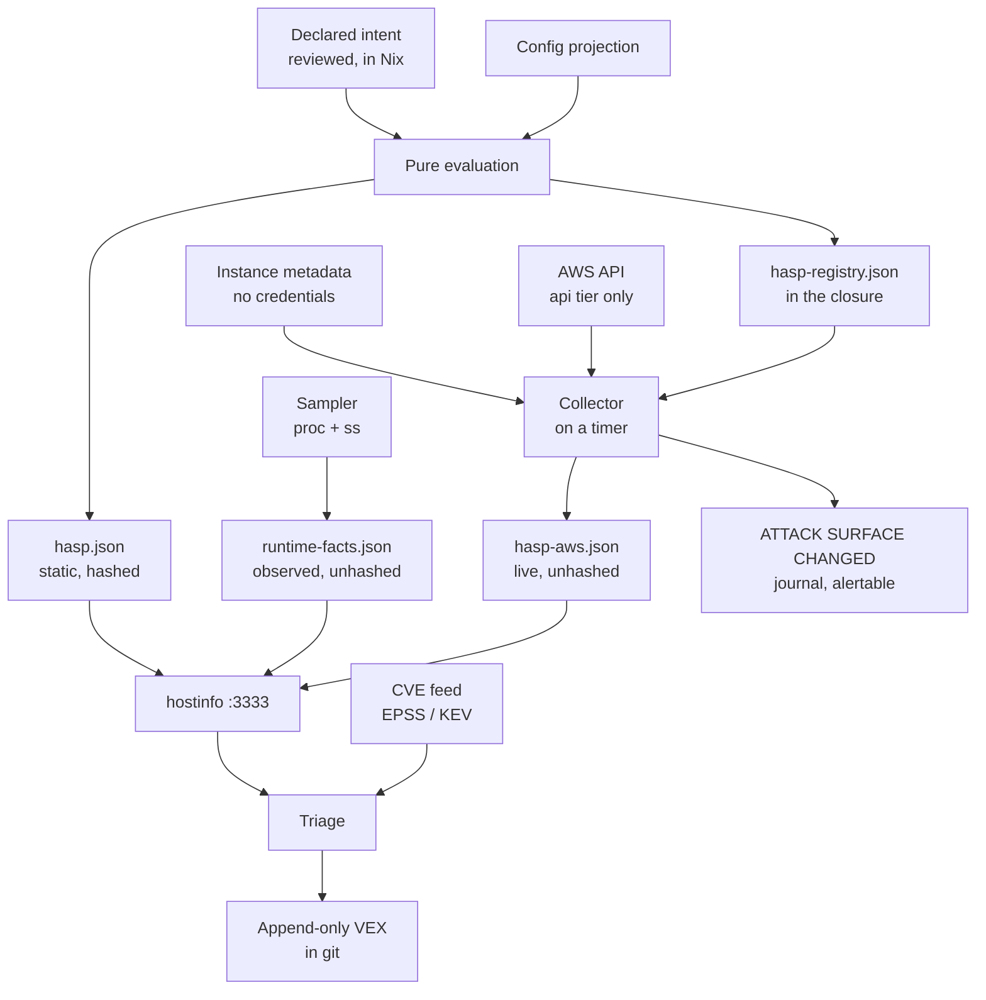

# HASP Framework

**Host Attack Surface Profile — the fact set that drives CVE triage**

Status: design for review. Not implemented.
Consumed by: [Vulnix CVE Automation](vulnix-cve-automation.md).
Revision: v2. See [What changed in v2](#18-what-changed-in-v2).

---

## 1. What a HASP is

A HASP answers one question, and only this question:

> Given that this package is vulnerable, what about *this machine* makes that
> matter, or not matter?

It is a set of facts. No CVEs, no verdicts, no scores, no prose. Every consumer
that needs to explain a decision cites facts from it by key.

"A HASP" is loosely three documents, because facts differ in **how they can
change**, and that difference — not their subject matter — decides where they
live:

| Document | Changes when | Hashed | Role |
|---|---|---|---|
| `hasp.json` | the machine is rebuilt | yes | the verdict basis |
| `hasp-aws.json` | the collector runs on the host, on a timer | no | live infrastructure facts |
| `runtime-facts.json` | continuously, on a timer | no | observed reality |

All three are served from `/var/lib/hostinfo/` on port 3333.

Splitting on rate-of-change is the central design decision of v2. A fact folded
into a hashed document changes that document's hash; a fact that changes every
five minutes would therefore invalidate every verdict continuously. Runtime
observation is not second-class evidence — section 7 argues it is the *strongest*
evidence we have — it simply cannot live in a hashed artifact.

### What it is not

| Not | Because |
|---|---|
| A vulnerability report | It knows nothing about CVEs; the scan does that |
| A triage record | Verdicts live in git as VEX, and remember the facts they relied on |
| LLM-written or LLM-modified | Every value is derived, declared by a named person, queried from an API, or observed. Nothing is generated prose |
| An inventory of packages | See rule 2. This is the rule most likely to be broken by accident |

---

## 2. Design rules

Six rules, in priority order. Everything else follows from them.

### Rule 1 — `hasp.json` is static and pure

Evaluated entirely at build time, materialising as a single store path symlinked
into `/var/lib/hostinfo/hasp.json`. No generator service, no timer, no runtime
templating.

`hasp-aws.json` and `runtime-facts.json` are explicitly exempt: both are collected
on the machine, because both describe things that change without a rebuild. Rule 6
covers observation; infrastructure facts are the same argument applied to the cloud
API — a fact folded into a hashed document either freezes a stale value or rehashes
every time it is read.

The consumer records *when it fetched* each document — as the exporter already
does with `inuse.json` mtime — so freshness is answered without the host holding
a clock.

### Rule 2 — Projections, not enumerations

**A HASP must not contain package names, versions, or any enumeration of an
upstream-defined set.**

Every deploy changes the closure. If closure contents were part of the profile,
the hash would change on every deploy, every verdict would be invalidated
continuously, and the team would face a full re-triage of roughly 250 records per
host every week. The board would be abandoned within a month.

v2 sharpens this, because "config, not closure" turned out not to be a clean
line. NixOS *modules* define systemd units, so a fact enumerating units is
downstream of package versions even though it reads `config`. Measured on a stock
NixOS system:

```
unit files:               163
loaded services:          114
no User=  (root)           47      ← a "rootUnits" fact would be this long
explicit User=             11
```

Roughly 47 entries, almost all nixpkgs-owned — `systemd-journald`, `dbus`,
`nix-daemon`, `sshd`. A nixpkgs bump adds, renames or reassigns units, the fact
changes, and verdicts invalidate for reasons unrelated to the machine's exposure.

The rule as it now reads: a derived fact may read our own option namespace and an
explicit whitelist of upstream options, and must be a **projection that answers a
question** rather than a list of whatever happens to exist.

Where completeness demands looking at the closure rather than at
`elastinix.services.*` — and it often does, because a host with
`services.postgresql.enable` set directly is invisible to our namespace and
plainly present in the closure — project the closure down to the question. Under-
reporting attack surface is the wrong direction to be wrong in.

### Rule 3 — Registered keys only

Fact keys form a closed, versioned registry (section 9). An unregistered key
fails the build.

Verdicts remember the facts they relied on, keyed by name. A typo —
`network.publicIPAttached` against `network.publicIpAttached` — produces a
verdict that silently never invalidates. A build failure is the only acceptable
outcome.

### Rule 4 — No defaults for judgement

Derived facts have no defaults because they are computed. **Declared facts have
no defaults either, and the build fails when one is missing.**

A `dataClassification` that defaults to `internal` is not a missing value, it is
a false claim, made by nobody, that will be cited in an audit. If a human has to
decide it, a human decides it or the machine does not build.

### Rule 5 — Fail loud, never fail quiet

Missing collector output, an unregistered key, an absent declaration, a stale
runtime document: all are failures, at build time where possible and as alerts
where not. A profile that is silently incomplete is worse than no profile,
because triage reads an absent fact as an absent risk.

### Rule 6 — What can be observed must be observed

*New in v2.* Where a fact can be measured on the running system, measurement wins
over derivation, and the fact belongs in `runtime-facts.json` rather than in the
hashed profile.

This is not a preference for empiricism. It is that the two most verdict-changing
facts we have — whether code ever executes, and whether a socket is bound to
loopback or to the world — are **not statically derivable at all**, and are
trivially observable. Section 7.

---

## 3. Architecture



Everything that can change without a rebuild is collected on the machine, which
makes change detection a property of collection rather than a separate check:

```
   COLLECTOR — on-host, every 15 minutes
   ─────────────────────────────────────
   metadata tier (zero IAM):     api tier (account-wide describe):
     • security group ids          • ingress rules
     • subnet id                   • reachable-from-groups
     • public IP present?          • subnet tier, load balancer, volumes
                    │
                    ▼
   compare against the previous document
                    │
       ┌────────────┴────────────┐
   no change                  changed ──▶ ATTACK SURFACE CHANGED
   exit 0                              exit 1, before/after per fact
```

---

## 4. Provenance

Every fact carries its origin, because the origin determines how much it can be
trusted and what invalidates it.

| Source | Origin | Can drift from reality? | Changes when |
|---|---|---|---|
| `derived` | Projected from `config.*` / the closure during evaluation | No — it *is* the configuration | The machine is rebuilt |
| `declared` | Asserted by a named engineer in Nix | Yes — intent goes stale | Someone edits and reviews it |
| `aws` | Queried on the machine from metadata and the live AWS API | No — re-read every interval | Infrastructure changes |
| `observed` | Measured on the running system | No — but it can be incomplete | Continuously |

`derived` facts cannot disagree with the running system without the system having
been changed outside Nix. `declared` facts are the weakest and the only ones needing
a review date. `aws` facts are current to within one collection interval, and a
failed collection leaves them detectably stale rather than quietly wrong.
`observed` facts are never wrong about what they saw, only ever incomplete about
what they did not see — a distinction that matters enormously and is handled in
section 7.

---

## 5. AWS fact collection

The facts that carry the most triage weight — security group ingress, public IP,
load balancer attachment, subnet tier — live in a layer that changes without any
Nix evaluation. Console edits, a targeted `terraform apply`, another team's module.

### Collected on the machine, on a timer

`elastinix-hasp-aws-collector.service` runs every `awsFactsIntervalSeconds` and
publishes `hasp-aws.json`. Not in `hasp.json`: a fact that changes without a
rebuild cannot live in a hashed document without either freezing a stale value or
rehashing on every collection.

### Why the live API and not Terraform state

Terraform state records what Terraform last believed. The API records what is.
Reading state would make the profile agree with our intentions rather than with
reality, which is the failure being eliminated rather than formalised.

### Two tiers, because credentials are the real cost

```
  metadata tier                          api tier
  ─────────────                          ────────
  instance metadata service              + ec2 / elbv2 describe calls
  169.254.169.254, no credentials        account-wide read
  ──────────────────────────────         ──────────────────────────
  network.securityGroupIds               network.ingressRules
  network.subnetId                       network.internetReachablePorts
  network.publicIpAttached                network.internetAllPortsOpen
                                         network.reachableFromGroups
                                         network.subnetTier
                                         network.behindLoadBalancer
                                         network.egressUnrestricted
                                         data.persistentVolumes
  IAM: none                              IAM: account-wide ec2:Describe*
  closure: unchanged                     closure: +~120 MB (boto3)
```

The metadata tier is genuinely free — IMDSv2 needs no credentials — and it covers
the two highest-consequence exposures: a change to the attached security groups,
and a public IP appearing.

**The api tier's cost cannot be scoped away.** EC2 describe actions do not support
resource-level permissions, so `DescribeSecurityGroupRules` cannot be limited to
the groups this host is in. Granting it means the host can enumerate every security
group, subnet and route table in the account. Read-only, but account-wide, and it
is a real increase in what a compromised host can map. Decide it per host.

What the api tier uniquely buys is **`reachableFromGroups`** — knowing a host is
reachable *from the jumphost* rather than merely "not from the internet", which is
the single fact most likely to change a verdict:

```
   internet ──✗── compute5          internetReachablePorts: []
                     ▲
                     │ 22, 3333, 5432 from sg-jumphost
                     │
                jumphost ◀── VPN ── every engineer
```

### The registry still governs collected facts

The registry is emitted into the closure as `hasp-registry.json`, and the collector
validates its own output against it before writing: an unregistered key, a
disagreeing type, or an unsorted list makes it exit without writing. Rule 3 holds
for facts produced after evaluation, enforced at runtime instead of build time.

### Two implementation traps

- **Route tables**: a subnet with no explicit association uses the VPC *main* route
  table. Filtering only on `association.subnet-id` returns nothing for such subnets,
  and reading that as "no internet route" would mark a public subnet private.
- **Wide port ranges**: a rule permitting an enormous range is recorded as
  `internetAllPortsOpen` rather than expanded into tens of thousands of integers.
  The fact triage needs is "everything is open", not a list.

---

## 6. Change detection

Because the collector re-reads reality every interval, it *is* the drift detection.
There is no separate check to keep honest — v1 had one, and once the AWS facts left
the hashed profile it had nothing left to compare.

Each collection is compared against the previously published document:

| Exit | Meaning |
|---|---|
| 0 | Collected; nothing changed |
| 1 | Collected; **the machine's exposure changed** |
| 3 | Collection failed — previous document kept, nothing written |
| 4 | Collected facts rejected by the registry — nothing written |

Exit 1 carries the detail, to the journal where it can be alerted on:

```
ATTACK SURFACE CHANGED: network.publicIpAttached, network.securityGroupIds
  network.publicIpAttached: False -> True
  network.securityGroupIds: ['sg-04bb2e77', 'sg-0f3a1c9d'] -> [..., 'sg-NEW']
```

The document also records `lastChanged` per fact and `changedKeys` for the latest
transition, which is what makes it a drift record rather than a snapshot.

### A failed collection publishes nothing

On any error the previous document is kept and the unit fails. A partial document
is worse than a stale one: an absent fact reads as an absent risk, while staleness
is detectable from `lastCollected`.

**Unavailability is not agreement.** An unreachable metadata service exits 3 rather
than reporting no change, so a host with a broken collector cannot look verified.

### What was given up

v1 proposed a daily pipeline-side comparison as an independent check that a host's
view matched the account's. With the host querying the API itself, its view *is* the
account's view, so that check collapses to "is the collector running" — which
`lastCollected` and the unit's own failure state already answer.

The collector reconciles nothing. It writes its own document and its report, and
touches neither `hasp.json` nor any triage record nor any AWS resource.

---

## 7. The runtime facts document

Two facts change verdicts more than anything in the static profile, and neither
is statically derivable.

### Bind address is the lever the static design misses

```
  ss -lntupH                                  /proc/<pid>/cgroup
  ──────────                                  ──────────────────
  LISTEN 0 244 127.0.0.1:5432  pid=1234  ───▶  postgresql.service   (root)
  LISTEN 0 128   0.0.0.0:3333  pid=5678  ───▶  elastinix-hostinfo-server.service
                    ▲
                    └── this distinction is worth more than the whole
                        network.* group put together
```

A service bound to loopback is unreachable from anywhere else, whatever the
security group says. `postgresql-17.10` is the joint-largest package on
compute2-prod at 26 CVEs; the static profile can only reason "5432 is not in the
firewall list, so not internet-reachable", while the observed socket supports the
far stronger and more defensible *"nothing outside this machine can reach it at
all."*

This also settles what v1 listed as an open question. Per-unit socket attribution
is not partially-derivable-and-honestly-labelled; it is directly observable, by
the sampler that already runs as root and already maps pid → cgroup → unit.

### Privilege context, from the join

Both halves now live in one document, so the join is local:

```
   openssl-3.6.0  ──units──▶  quiqr-server.service  ──user──▶  root
                                      │
                                      └──socket──▶  0.0.0.0:443
   ⇒ "vulnerable code executes as root in a process listening on all interfaces"
```

Neither the static profile nor the package scan can produce that sentence alone.

### Staleness contract

Runtime facts are the only unhashed input to a verdict, so they need their own
freshness discipline. Same shape as `inuse.json`, which the exporter already
handles:

| Field | Purpose |
|---|---|
| `schemaVersion` | |
| `intervalSeconds` | lets a consumer compute how many samples a window should have produced |
| `firstSample`, `lastSample` | the observation window |
| `sampleCount` | how much looking was done |

Rules, mirroring the existing `inuse` label handling:

- staleness is measured against the document's **fetch time** (mtime of the
  persisted copy), not wall-clock now — the scan runs weekly, so a healthy
  document is legitimately days old when scraped
- a gap is inferred from `sampleCount` against what `intervalSeconds` and the
  window imply
- absent, unparseable, stale or gapped resolves to **`unknown`**, never to a
  negative claim

### Cumulative versus current, and why negative claims must use cumulative

Sockets and in-use packages differ in an important way. A package observed once
is proof it executes. A socket observed once is proof it was bound *then*.

So the document records both, and the two support different claims:

| | Basis for | Because |
|---|---|---|
| `current` — last sample | "this is bound right now" | reporting, dashboards |
| `observed` — cumulative, with counts | **"this was never bound externally"** | the conservative direction |

A negative verdict must cite the cumulative set. A service that binds an external
socket only under load would be missed by any single sample, and granting
unreachability on a snapshot would be exactly the silent-wrongness failure this
framework exists to prevent.

The corollary is the same one that applies to in-use data: the cumulative set only
grows, so counts of "never observed externally bound" will *decrease* over time.
That is the mechanism working.

---

## 8. The fact record

Each fact is an attribute set, not a bare value:

```nix
{
  value = [ 22 ];
  source = "derived";
  evidence = "config.networking.firewall.allowedTCPPorts";
}
```

| Field | Required | Purpose |
|---|---|---|
| `value` | yes | The fact. Bool, string, int, or sorted list |
| `source` | yes | `derived`, `declared`, `aws`, or `observed` |
| `evidence` | yes | A Nix option path, an AWS resource id, a `ss` line, or the name of the person who decided it |

`evidence` is what makes a verdict answerable. *"Not reachable from the
internet"* invites an argument; *"`sg-0f3a` permits 443 from `sg-jumphost` only,
and postgres is bound to 127.0.0.1"* ends one.

Lists must be sorted at construction. Nix sorts attribute names automatically, so
`builtins.toJSON` is stable for attribute sets — but list order is preserved
verbatim, and an unsorted list would rehash on any upstream ordering shift.

---

## 9. Fact registry v2

Closed set. The discipline that shaped v2: **a fact that no justification cites is
decoration.** Section 13 is the authority on what is cited.

### Host facts

Only `derived` and `declared` facts appear in `hasp.json`. The `aws`-sourced facts
below are published in `hasp-aws.json` by the on-host collector, because they change
without a rebuild. Both documents are keyed by the same registry, so a verdict cites
facts the same way regardless of which document carries them.

#### `identity.*`

| Key | Type | Source | Notes |
|---|---|---|---|
| `identity.hostname` | string | derived | `config.networking.hostName` |
| `identity.environment` | enum | declared | `prod`, `nonprod`, `dev` |
| `identity.role` | string | declared | What the machine is for, in a few words |
| `identity.owner` | string | declared | Team accountable for remediation |
| `identity.dataClassification` | enum | declared | `public`, `internal`, `confidential`, `special` |

Cited by the accepted-risk threshold: the same EPSS score justifies different
action on a `confidential` prod host than on a `dev` box.

#### `network.*`

The group that resolves the most findings, because most CVEs need a network path.

| Key | Type | Source | Notes |
|---|---|---|---|
| `network.securityGroupIds` | list | aws · metadata | Free; change reported by the collector |
| `network.subnetId` | string | aws · metadata | Free |
| `network.publicIpAttached` | bool | aws · metadata | Free; change reported by the collector |
| `network.subnetTier` | enum | aws · api | `public`, `private`, `isolated` |
| `network.ingressRules` | list | aws · api | One entry per permitted rule — raw evidence |
| `network.internetReachablePorts` | list of int | aws · api | Ports whose source resolves to `0.0.0.0/0` |
| `network.internetAllPortsOpen` | bool | aws · api | **New in v2.** Set when a world-facing rule covers all protocols or a very wide range |
| `network.reachableFromGroups` | list | aws · api | **New in v2.** `{ group, ports }` per referencing group |
| `network.behindLoadBalancer` | bool | aws · api | Attached to a target group |
| `network.egressUnrestricted` | bool | aws · api | Bears on exfiltration and callback-style exploits |
| `network.firewallOpenPorts` | list of int | derived | `networking.firewall.allowed{TCP,UDP}Ports` |
| `network.isJumphost` | bool | declared | Intent, not config — a jumphost is one because we say so |

`reachableFromGroups` closes a real hole in v1. A host with
`internetReachablePorts: []` read as unreachable, when in fact:

```
   internet ──✗── compute5          internetReachablePorts: []
                     ▲
                     │ 22, 3333, 5432 from sg-jumphost
                     │
                jumphost ◀── VPN ── every engineer
```

For a CVE needing only adjacent-network access, v1 could not distinguish
"unreachable" from "reachable by everyone in the company".

`firewallOpenPorts` and `internetReachablePorts` deliberately overlap: a port open
in the host firewall but closed at the security group is a different risk from one
open in both, and collapsing them hides the distinction that decides the verdict.

#### `runtime.*`

Reduced in v2 — almost everything here moved to observation.

| Key | Type | Source | Notes |
|---|---|---|---|
| `runtime.dockerEnabled` | bool | derived | Container runtime present |
| `runtime.localDatabases` | list of string | derived | Closure projection, not namespace: catches `services.postgresql.enable` set directly |
| `runtime.nixosStateVersion` | string | derived | Config, not closure — permitted under rule 2 |

#### `data.*`

| Key | Type | Source | Notes |
|---|---|---|---|
| `data.persistentVolumes` | list of string | aws · api | Attached EBS volumes |

`data.backupsConfigured` was drafted and dropped: nothing we run can produce it, and
a registered fact no collector fills is decoration.

### Fleet facts — the `fleet` section of `hasp.json`

Measured against the repository, these are identical on every host:

```
modules/nixos/services/base-system.nix:5
    services.fail2ban.enable = true;        ← unconditional, fleet-wide

auditd            → absent from modules/ entirely
log shipping      → absent from modules/ entirely
openssh settings  → not set in elastinix (nixpkgs defaults)
```

A fact with no variance across hosts and none over time cannot discriminate
between findings, and duplicating it into six profiles pretends otherwise. They
are not worthless — a fleet-wide fail2ban regression *should* invalidate every
verdict that leaned on it, and "we run fail2ban everywhere" is a real audit
assertion — they are simply **fleet assertions, not per-host facts**.

| Key | Type | Source | Notes |
|---|---|---|---|
| `fleet.systemdHardeningDefault` | bool | derived | Elastinix services hardened by default |
| `fleet.fail2banEnabled` | bool | derived | `base-system.nix` |
| `fleet.auditdEnabled` | bool | derived | Currently `false` |
| `fleet.centralLogShipping` | bool | derived | Currently `false`; is there anywhere to look after an incident |
| `fleet.sshPasswordAuthentication` | bool | derived | nixpkgs default |
| `fleet.inUseSamplerEnabled` | bool | derived | Per-host in principle; fleet in practice once rollout completes |

Carried as a separately-hashed section of each host's document rather than a
seventh file. Invalidation is value-based (section 12), so correctness does not
depend on the split — it is organisational honesty plus a `fleetHash` that lets a
consumer see at a glance that a change was fleet-wide rather than local. A
separate file would need its own distribution and freshness path for no gain.

Three of these six are currently `false`, which makes the group less "evidence of
controls" and more "a to-do list we publish". That is uncomfortable and correct.

### Observed facts — `runtime-facts.json`

| Key | Type | Notes |
|---|---|---|
| `inuse.observed` | map | Existing: package name → `{ samples, lastSeen, units }` |
| `sockets.observed` | map | Cumulative: `{ port, proto, bindClass }` → `{ samples, lastSeen, units, users }` |
| `sockets.current` | list | Last sample only |
| `units.user` | map | Unit → sorted list of users observed running it |

`bindClass` is `loopback`, `wildcard` or `specific` — the derived distinction that
matters, kept next to the raw address rather than replacing it.

`units.user` replaces v1's `runtime.rootUnits`: observed rather than enumerated,
complete rather than namespace-limited, unhashed so a nixpkgs bump churns nothing,
and in the same document as the `units` field it needs to join against.

It records a **list** of users per unit rather than one value. A unit whose main
process runs as root and drops privileges in a child would lose the root fact if
collapsed, and "does any process of this unit run as root" is the question
privilege context actually asks.

---

## 10. Module interface

```nix
elastinix.hasp = {
  enable = true;

  # Rule 4: no defaults. Every one of these must be stated.
  declared = {
    environment        = "prod";
    role               = "customer-facing application host";
    owner              = "managed-services";
    dataClassification = "confidential";
    isJumphost         = false;

    reviewedBy = "luca.kasper";
    reviewedAt = "2026-08-26";
  };
};
```

Infrastructure fact collection is a single enum:

```nix
elastinix.hasp.awsFacts = "metadata";   # "none" | "metadata" | "api"
```

```nix
awsFacts = lib.mkOption {
  type = lib.types.enum [ "none" "metadata" "api" ];
  default = "none";
};
```

Defaulting to `none` is not timidity: the `api` tier grants the host account-wide
`ec2:Describe*`, and that is not something a module should turn on for you. The
`metadata` tier costs nothing and is the sensible first step everywhere.

There is deliberately **no** option pointing at a file in the configuration
repository. An earlier draft had one, and it carried a trap worth recording: Nix
resolves a relative path against the file the literal appears in, so a default of
`"hasp-aws.json"` declared in the module resolves against the *module's* directory;
and a collector output file must be git-tracked before Nix can see it at all, so
collection would have meant a deploy mutating the configuration repo.

Review metadata is **block-level, not per-fact**: one reviewer and one date for
the whole declared section. Per-fact review would be more precise, and would also
be abandoned within two quarters. A block reviewed as a unit is a block that
actually gets reviewed.

`reviewedAt` staleness cannot be checked at build time — Nix has no clock, by
design. It is published as a fact and alerted on from Prometheus, which is the
honest place for a time-dependent check.

---

## 11. Output

### `hasp.json`

```json
{
  "schemaVersion": 2,
  "registryVersion": 2,
  "host": "compute5-prod",
  "haspHash": "1f3c9a7e5d2b8046",
  "fleetHash": "9b04e7c1a3f5d228",
  "declaredReview": { "by": "luca.kasper", "at": "2026-08-26" },
  "facts": {
    "identity.dataClassification": {
      "value": "confidential",
      "source": "declared",
      "evidence": "luca.kasper, 2026-08-26"
    },
    "network.firewallOpenPorts": {
      "value": [22, 3333],
      "source": "derived",
      "evidence": "config.networking.firewall.allowedTCPPorts"
    }
  },
  "fleet": {
    "fleet.fail2banEnabled": {
      "value": true,
      "source": "derived",
      "evidence": "modules/nixos/services/base-system.nix:5"
    },
    "fleet.auditdEnabled": {
      "value": false,
      "source": "derived",
      "evidence": "absent from modules/"
    }
  }
}
```

There is deliberately no `generatedAt`. A pure store path has no build clock, and
a fabricated one would be the only untrustworthy field in the document.

### `runtime-facts.json`

```json
{
  "schemaVersion": 1,
  "intervalSeconds": 300,
  "firstSample": "2026-08-25T13:20:13Z",
  "lastSample": "2026-09-24T10:05:00Z",
  "sampleCount": 8641,
  "sockets": {
    "observed": {
      "5432/tcp/loopback": {
        "samples": 8641, "lastSeen": "2026-09-24T10:05:00Z",
        "units": ["postgresql.service"], "users": ["postgres"]
      },
      "3333/tcp/wildcard": {
        "samples": 8641, "lastSeen": "2026-09-24T10:05:00Z",
        "units": ["elastinix-hostinfo-server.service"], "users": ["nobody"]
      }
    },
    "current": [
      { "port": 5432, "proto": "tcp", "address": "127.0.0.1",
        "bindClass": "loopback", "unit": "postgresql.service", "user": "postgres" }
    ]
  },
  "units": { "user": { "postgresql.service": ["postgres"],
                       "quiqr-server.service": ["root"] } }
}
```

`inuse.observed` continues unchanged in this document; the existing sampler
already produces it.

---

## 12. Hashing and invalidation

```nix
haspHash = builtins.hashString "sha256"
  (builtins.toJSON (lib.mapAttrs (_: f: f.value) hostFacts));
```

**The hash covers `value` only** — not `evidence`, not `source`, not the review
stanza. Correcting an AWS resource id in an `evidence` string, or re-confirming a
declaration on a new date, changes nothing about the machine's exposure and must
not invalidate a verdict. Reviewing a profile should never be discouraged by the
cost of reviewing it.

### Verdicts remember values, not just keys

v1 required the scanner to store the previous profile per host and diff it. v2
does not, and the change is a strict improvement.

Each verdict records the **values** of the facts it relied on:

```yaml
cve: CVE-2025-15467
package: openssl-3.6.0
host: compute5-prod
justification: vulnerable_code_cannot_be_controlled_by_adversary
depends_on:
  network.internetReachablePorts: []
  network.reachableFromGroups: [{ group: sg-jumphost, ports: [443] }]
  network.behindLoadBalancer: false
  sockets.observed["443/tcp/wildcard"]: absent
```

Invalidation is then a pure comparison against the current documents:

```
   for each verdict:
       for (key, remembered) in verdict.depends_on:
           if current_value(key) != remembered:  ──▶ mark STALE
```

```
   v1 (stateful)                        v2 (stateless)
   ─────────────                        ──────────────
   hasp(t) vs hasp(t-1)                 hasp(t) vs the verdict's own memory
   needs per-host history               needs nothing
   wrong on first run                   correct on first run
   wrong if a week was missed           immune to gaps
   changed-set → intersect              direct per-verdict comparison
```

The verdict becomes self-describing: it carries the state of the world it was
decided under, which is also better audit evidence — the record shows what was
*believed*, not merely which keys were consulted.

`haspHash` therefore stops being the mechanism and becomes a cheap early exit:
hash unchanged, skip the host. Worth keeping; not load-bearing.

**This also settles registry evolution.** A removed key needs no `deprecated`
tombstone: a verdict citing a key that is no longer present finds it absent, which
is a mismatch, which invalidates. Removal handles itself.

### The comparison must never write `depends_on`

```
   WRONG                                RIGHT
   ─────                                ─────
   compare → mismatch                   compare → mismatch
        │                                    │
        └─▶ update depends_on                └─▶ mark verdict STALE
            verdict now "valid"                  (read-only)
            forever, silently wrong                    │
                                                       ▼
                                              triage writes a NEW verdict
                                              with fresh remembered values,
                                              reviewed as a pull request
```

If the process detecting staleness also refreshes the memory, nothing is ever
stale again. It is a test that rewrites its own snapshot on failure: permanently
green, permanently meaningless.

Comparison is strictly read-only. Verdicts are **append-only** — a stale verdict
is superseded, never mutated. The audit trail comes for free: *this was judged
not-affected under these facts on this date; the facts changed; here is the new
judgement.* In-place editing destroys precisely the artifact that makes the
programme defensible.

### Who checks, and when

| On rebuild (pipeline) | On scan (compute5, weekly and on demand) |
|---|---|
| new `hasp.json` vs verdict memory | new `hasp.json` vs verdict memory |
| fast feedback while the change is still in the engineer's head | plus new CVEs, refreshed EPSS/KEV, current runtime facts |
| **not authoritative** — knows nothing about new CVEs | **the system of record** |

---

## 13. How triage consumes it

The last column is the point: a profile is necessary for triage and sufficient for
only some of it.

| VEX justification | Required minimum `depends_on` | Static alone? |
|---|---|---|
| `vulnerable_code_not_in_execute_path` | `inuse.observed`, `sampleCount`, `fleet.inUseSamplerEnabled` | No — observation |
| `vulnerable_code_cannot_be_controlled_by_adversary` | `network.internetReachablePorts`, `network.reachableFromGroups`, `network.behindLoadBalancer`, `sockets.observed` | No — needs bind class |
| `inline_mitigations_already_exist` | the specific `fleet.*` or `mitigations.*` key claimed | Yes |
| `vulnerable_code_not_present` | build-time feature flags | **Not derivable today** |

`component_not_present` is absent by design: vulnix reports from the machine's
closure, so a package that is not installed never produces a finding.

`vulnerable_code_not_present` is listed with no supporting facts because we cannot
honestly claim it. Knowing a CVE affects a component excluded by a build flag needs
per-package knowledge no profile holds. Better to record the gap than approximate
it.

### The required minimum is enforced, not advisory

A verdict citing `vulnerable_code_cannot_be_controlled_by_adversary` while
depending only on `internetReachablePorts` would **never invalidate** when
`behindLoadBalancer` flips to `true`. The machine becomes reachable and the
register stays green.

So this table is a schema, and CI rejects a verdict that cites fewer than the
required keys for its justification. A verdict may depend on more, never less.
Under-citation is caught at pull-request time rather than three years later.

---

## 14. Validation

Build-time assertions, all fatal:

- a fact key outside the registry, in either the host or the fleet section
- a fact whose declared `source` or value type disagrees with the registry
- a declared fact absent, or `reviewedBy`/`reviewedAt` missing
- an enum value outside its permitted set
- a list fact that is not sorted

Verdict-time checks, in CI on the VEX repository:

- `depends_on` missing a key the justification requires (section 13)
- a verdict mutating an existing record's `depends_on` rather than superseding it

Collector-time checks, on facts produced after evaluation:

- a collected key absent from the registry manifest
- a collected value whose type disagrees, or a list that is not sorted
- any collection error at all — the previous document is kept and the unit fails

Monitoring checks, since Nix sees neither time nor the network:

- all served documents parseable on every host — a 404 is an alert, not a gap to
  work around
- `declaredReview.at` older than the review interval
- the collector unit failing, and `ATTACK SURFACE CHANGED` in its journal output
- `lastCollected` older than `intervalSeconds` implies
- `runtime-facts.json` stale or gapped against its own `intervalSeconds`

---

## 15. Exposing it on port 3333

A HASP is, by construction, a description of a machine's attack surface: open
ports, reachable-from groups, which mitigations are absent. Publishing it
unauthenticated deserves a deliberate decision rather than an assumption.

The decision: **serve all three documents**, because the central scanner needs
them and the endpoint is already inside the VPC with the port closed at the
security group — the same trust boundary that already carries `services.json` and
`packages.json`, which between them list every enabled service and every installed
package with versions. These add context, not a new class of exposure.

Two conditions attach:

1. None of the documents may be reachable outside the VPC. If hostinfo gains external
   exposure through the planned nginx vhost (bean `elastinix-n3zn`),
   authentication is a prerequisite, not a follow-up.
2. `access.instanceProfilePolicies` and `access.interactiveUsers` were the most
   sensitive fields in v1 and **have been cut** — no justification cited either.
   Apply the same test to anything proposed for v3: if no justification depends on
   it, drop it rather than protect it.

Worth stating plainly: an attacker who can read this endpoint is already inside the
network segment and can enumerate most of it directly. The documents save them
time; they do not grant access.

---

## 16. Explicitly out of scope

- **Package and closure inventory** — rule 2, the most important exclusion
- **CVE data, scores, KEV or EPSS state** — collected per-finding at triage time
- **Triage verdicts and justifications** — append-only VEX in git
- **Container image inventory** — dynamic; `docker-images.json` covers it
- **Secrets, key material, or anything agenix manages**
- **Anything written by a model** — no generated content in any of the three
  documents

---

## 17. Open questions

1. **Is the `api` tier worth account-wide describe permissions on any host?** The
   `metadata` tier already covers the group set and public-IP presence for free.
   The `api` tier's distinctive contribution is `reachableFromGroups`, the fact most
   likely to change a verdict — but the grant cannot be scoped, so this is a
   security judgement rather than a technical one.
2. **Should the change report reach Prometheus, not only the journal?** A unit
   failure is alertable today; *which* fact changed is only in the journal text.
3. **Sockets bound only under load.** The cumulative set handles this in the safe
   direction, but a service that binds an external listener for one minute a month
   will read as never-externally-bound for a long time. Is there a cheaper signal
   than raising the sample rate?
4. **`runtime.localDatabases` as an upstream-option projection.** More complete
   than reading our own namespace, but each engine must be named individually
   because renamed upstream options abort on access. Which engines are worth
   encoding?
5. **Does the fleet section want its own review stanza?** Its facts are derived,
   so they need no reviewer — but "we accept that auditd is off fleet-wide" is a
   judgement somebody should own.

---

## 18. What changed in v2

| Area | v1 | v2 |
|---|---|---|
| Infrastructure facts | Terraform state, written into the stack | **live AWS API and instance metadata, collected on the machine** on a timer |
| Credential cost | unexamined | **tiered**: `metadata` needs no IAM at all; `api` needs account-wide describe, opted into per host |
| Identity for the query | unspecified | the host's own instance metadata — nothing to pass in |
| Drift | acknowledged, unbounded | **a property of collection**: each run diffed against the last, changed facts reported with before/after |
| AWS facts in the hash | in `hasp.json` | moved out — they change without a rebuild |
| Invalidation | scanner stores previous profiles and diffs | **verdicts remember values**; stateless comparison |
| Verdict lifecycle | unstated | **append-only**; the comparison never writes `depends_on` |
| `depends_on` completeness | prose table | **enforced schema** per justification |
| Sockets and bind address | absent | first-class observed facts; the strongest single lever |
| `runtime.rootUnits` | derived, ~47 nixpkgs-owned entries, churned on bumps | `units.user`, observed, unhashed |
| `mitigations.*` | per-host facts | `fleet.*` section, separately hashed — measured as fleet-constant |
| `access.*` | four facts | cut entirely; nothing cited them |
| Documents | one | three, split by rate of change |
| Registry evolution | open question | solved by value-based invalidation |
| Per-unit sockets | open question | solved by observation |
