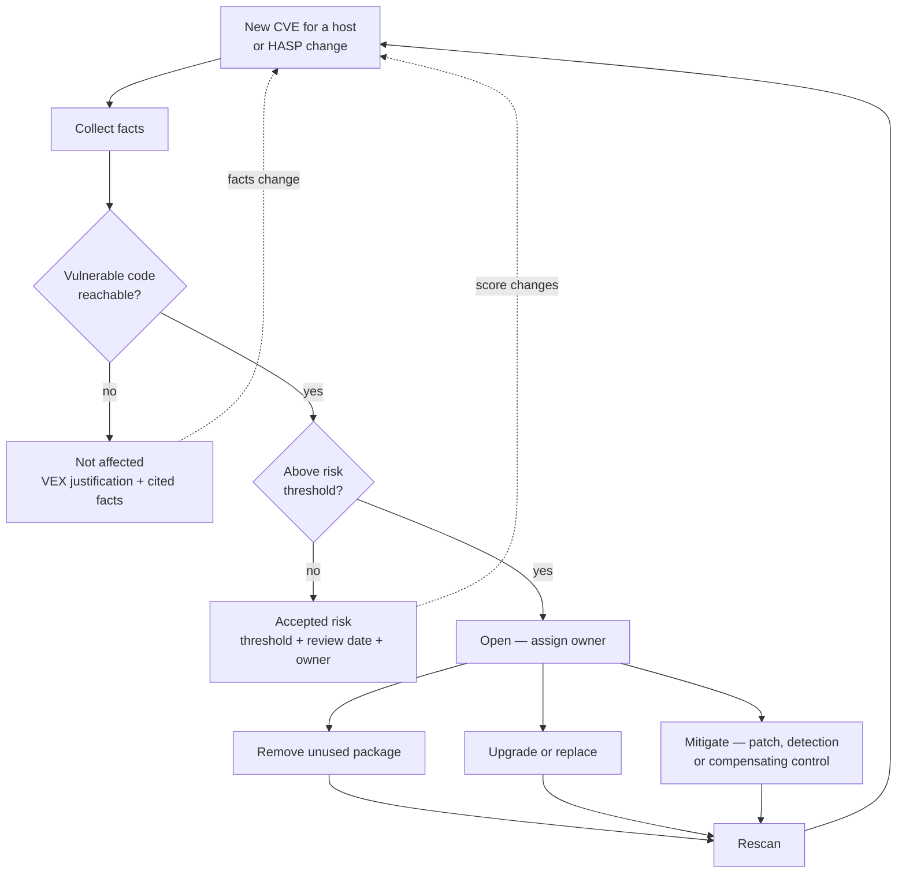

# Vulnix CVE Automation

**A plan for the managed service team — automated triage of vulnix findings, per machine**

Status: proposal for review. Nothing in Phase 1 onward is built yet.
Audience: the engineers who receive vulnerability findings and act on them.

**HASP** (Host Attack Surface Profile) is the framework this plan uses to decide
what a finding means on a given machine. It is a component here, not the
programme — see [HASP Framework](hasp-framework.md) for its structure.

---

## 1. The problem, honestly stated

Our vulnerability scanning works. That is the problem.

A weekly central scan reports every CVE that any package in a machine's closure
has ever been associated with. Fleet-wide that is **449 distinct CVEs**. Not one
of them is currently on the CISA Known Exploited Vulnerabilities list, and
exactly one has an EPSS score above 0.10 — `CVE-2025-15467`, against
`openssl-3.6.0`, which arrives via a stale flake pin.

So the technical position is good and the reported position looks alarming. An
ISO 27001 auditor reads 449 open findings and asks a reasonable question we
currently cannot answer at scale: *which of these can actually hurt this
machine, and how do you know?*

Today that answer is produced by an engineer reading advisories by hand. It does
not scale to six machines, it is not reproducible, and when the machine changes
nobody re-checks the conclusions. A **Host Attack Surface Profile (HASP)** is how
we make that answer mechanical, per machine, and re-checkable.

### What "triage" is actually buying us

It is not making numbers smaller. It is separating three genuinely different
situations that currently look identical in a dashboard:

- the vulnerable code is not present, never runs, or cannot be reached
- the code is reachable but the risk is below the threshold we have set
- the code is reachable and the risk is real

The first is a **factual claim** about the machine. The second is a **decision**
we have made. The third is **work**. Filing all three under "known CVE" is what
makes the report unusable.

---

## 2. What already exists

Phase 0 shipped and is running in production. It is worth knowing what it gives
you, because the whole plan builds on it.

| Capability | Where | What it tells you |
|---|---|---|
| Central vulnix + trivy scan | `vulnerability-scan-central` on compute5-prod | Weekly per-host CVE findings from `packages.json` |
| Corrected counting | `vulnerability-prometheus-exporter` | One finding per source package, not per store path; other vendors' CVEs no longer attributed to ours |
| In-use sampling | `hostinfo.enableInUseSampler` | Which packages have actually been observed executing, and by which systemd unit |
| Coverage metrics | Prometheus | How many samples back a claim, and when the last one was taken |

The counting fixes brought the fleet from **836 reported CVE-instances against
474 distinct CVEs** down to **468 instances**, with no change in scan coverage
and no finding hidden. That was accuracy, not remediation, and it is recorded as
such.

The in-use sampler is the part that matters most here, because it is the first
attack-surface fact we collect empirically rather than assert:

| Host | Findings on code observed executing | Findings on code never observed |
|---|---|---|
| compute5-prod | 82 | 178 |
| compute2-prod | 71 | 140 |

Read that carefully. "Never observed" is **not** "never runs" — it means never
observed at a five-minute sampling cadence within the recorded window. A
long-running daemon is caught reliably; a job that fires for three seconds a
week essentially never is. The document records `sampleCount`, `firstSample` and
`lastSample` precisely so a claim can be stated as *"never observed in 8,641
samples over 30 days"* rather than as a bare boolean.

This is also why the observed set only ever grows, and why the "never observed"
count will **fall** over time. That is the mechanism working, not a regression.

---

## 3. What a HASP is

Three documents per machine, split by **how each fact can change** — because that
determines what it can be trusted to prove and when a decision based on it goes
stale.

| Document | Changes when | Holds |
|---|---|---|
| `hasp.json` | the machine is rebuilt | declared intent, configuration facts, infrastructure exposure |
| `hasp-aws.json` | the deploy collector runs | raw AWS evidence behind the above |
| `runtime-facts.json` | continuously, on a timer | what actually executes and what actually listens |

All three are served by `hostinfo` on port 3333, next to the documents already
there.

**Declared by hand** — because some exposure is intent, not code: is this a
jumphost, who owns the machine, what data classification it handles. Each
declared block carries a reviewer and a review date. Intent that nobody owns goes
stale silently, which is worse than not recording it.

**Derived from the machine's own configuration** — open firewall ports, whether
Docker is enabled, which database engines are configured.

**Queried from the live AWS API** at deploy time — subnet tier, public IP,
security group ingress rules, which *other* security groups can reach us, load
balancer attachment. Deliberately the live API rather than Terraform state:
state records what Terraform last believed, the API records what is.

**Observed on the running system** — which packages actually execute, which
sockets are actually bound and *to what address*, which user each unit really
runs as.

That last group carries more weight than its position suggests. A service bound
to `127.0.0.1` is unreachable from anywhere else whatever the security group says
— and neither the Nix configuration nor the AWS API can tell you which address a
process bound to. It has to be measured.

**Why the split matters.** `hasp.json` is hashed and static, so a verdict can
cite it and be reconstructed later. Runtime facts change every five minutes;
folding them into a hashed document would invalidate every verdict continuously.
Triage joins the two at decision time and records which facts from each it
relied on.

**The static half can go stale, and we bound it deliberately.** Security groups
can be edited outside the deploy path, so two checks run against reality: the
host verifies its own security-group set, subnet and public-IP status every 15
minutes using instance metadata (which needs no credentials at all), and the
deploy pipeline re-queries AWS in full once a day. Divergence is treated as a
finding in its own right — infrastructure drift worth knowing about regardless of
any CVE.

See [HASP Framework](hasp-framework.md) for the fact registry and the mechanics.

---

## 4. Three registers, not one whitelist

This is the single most important distinction in the plan, and the one most
likely to be got wrong.

| Register | Meaning | Who decides | What invalidates it |
|---|---|---|---|
| **Not affected** | Vulnerable code absent, never executes, or unreachable by an adversary | Derived from facts | A change to the HASP facts it cited |
| **Accepted risk** | Code is reachable; risk is below our threshold | A person, against a written threshold | A change in EPSS, KEV status or CVSS |
| **Open** | Reachable and material | — | Closed by fixing it |

"Below the risk threshold" is **not** a claim of non-affectedness. The machine
*is* affected and we have chosen not to act. Filing that alongside "the code
does not exist on this host" means the accepted risks become invisible — and
those are exactly the ones that need re-review, because EPSS moves. Scores spike
and decay within a day or two; a finding parked at EPSS 0.004 can cross the
threshold without anything about the machine changing.

Two registers, two lifecycles, two triggers. Share the list and the accepted
ones will rot.

The payoff is the audit conversation. *"We have 250 findings on this host: 180
not affected with stated justification, 60 accepted risk against a documented
threshold, 10 open with named owners and dates"* is a defensible position.
*"We have a whitelist of 240"* is not.

### Mapping to a standard

The not-affected register uses the VEX justification codes rather than prose
categories of our own invention, so the output is machine-readable and means the
same thing to an external party:

| Code | Use it when |
|---|---|
| `vulnerable_code_not_present` | Package present, but the affected component is not built in |
| `vulnerable_code_not_in_execute_path` | Present but never observed executing |
| `vulnerable_code_cannot_be_controlled_by_adversary` | Executes, but no reachable input path |
| `inline_mitigations_already_exist` | Reachable, but a compensating control blocks it |

`component_not_present` is in the VEX standard but has no use for us. Vulnix
reports findings from the machine's closure, so a package that is not installed
never produces a finding to justify in the first place. If it ever appears in
our output, that is a scanner bug to fix, not a record to triage.

VEX deliberately has no status for "low risk". That absence is the reason the
accepted-risk register exists separately.

---

## 5. How a record gets triaged



### The rule that keeps this auditable

**Facts decide the verdict. The AI writes the justification.**

An auditor asking why a CVE was dismissed cannot be answered with "a model
concluded that" — it is not reproducible, and the model changes underneath us.
So every record stores the machine-checkable facts it relied on, and the
generated prose cites them:

```yaml
cve: CVE-2025-15467
package: openssl-3.6.0
host: compute5-prod
hasp_version: 7
facts:
  inuse.observed: true              # 8641/8641 samples, quiqr-server.service, 30d
  network.internetReachablePorts: []           # sg-0abc: no 0.0.0.0/0 ingress
  network.reachableFromGroups:                 # but the jumphost can reach it
    - { group: sg-jumphost, ports: [443] }
  sockets.observed["443/tcp/wildcard"]: present # bound to all interfaces
  epss: 0.104                                  # as of 2026-08-26
  kev: false
  patched: false
depends_on:                    # remembers VALUES, not just key names
  network.internetReachablePorts: []
  network.reachableFromGroups: [{ group: sg-jumphost, ports: [443] }]
  sockets.observed["443/tcp/wildcard"]: present
verdict: open
```

Every fact is verifiable from a scan result, a live AWS query, an observation
on the host, or a public feed.

The record remembers the *values* it relied on, not just which facts it consulted.
That makes staleness a direct comparison against the current documents, with no
history to keep — and it means the record shows what was believed at the time,
which is what an auditor actually asks for.
The model's contribution is the readable reasoning and a *proposed* verdict — a
draft an engineer approves, not an authority. If the model is later found wrong
about how it read a fact, `depends_on` lets us find every record that leaned on
the same one.

### Re-triage is a set difference, not a sweep

`depends_on` is what makes automatic re-triage affordable. Without it, any HASP
change invalidates every verdict, and we would be re-triaging roughly 250
records across six hosts every time someone edits a security group. The output
would be too noisy to read, and people stop reading noisy boards.

With it, opening port 443 invalidates only the verdicts that cited
`network_reachable`, and leaves the "this code never executes" verdicts
untouched. Likewise, the sampler flipping a package from never-observed to
observed invalidates exactly the verdicts that leaned on non-execution.

---

## 6. Where the records live

**In git, alongside the machine's configuration.** Not in a database, not in a
ticket system.

The reason is audit rather than engineering. A human override — *"an engineer
judged this not relevant because…"* — becomes a commit with an author, a date, a
diff and a reviewer. That is exactly the evidence chain ISO 27001 wants for an
exception, and we get it for free instead of building an approval workflow.

Machine-derived verdicts are committed by CI. Human overrides arrive as pull
requests. Triage verdicts outlive individual deploys, so they cannot live in a
Nix store path.

---

## 7. What changes for the managed service team

The part that affects your week.

**What you stop doing**

- Reading advisories for CVEs against code that does not run on the host
- Re-deciding the same finding after every deploy
- Triaging other vendors' CVEs. Every `git` finding on our hosts was a Jenkins
  Git Plugin or Git for Windows advisory; that is already fixed

**What you start doing**

- Working an **open** queue instead of a findings list. Open records have an
  owner and a route: remove the unused package, upgrade it, or mitigate
- Reviewing **override PRs** — a colleague claiming a record is not relevant
  needs a second pair of eyes, same as any code change
- Handling **re-triage notifications** when a HASP change invalidates verdicts.
  These should be rare and specific; if they are noisy, that is a bug in
  `depends_on`, not something to filter out

**What you must not do**

- Quote `in_use: false` as proof that code never runs. It means never observed
  at this cadence, within a stated window
- Treat an absent or stale in-use document as `false`. It resolves to
  `unknown` by design — if the sampler dies, every unobserved package would
  otherwise flip to "safe" and the report would silently claim more safety than
  we have
- Add `ProtectProc` or `PrivateUsers` to the sampler unit during a hardening
  pass. Either one hides other processes from `/proc`, so the sampler observes
  nothing while still exiting successfully
- Edit an existing verdict's remembered facts to make it valid again. A stale
  verdict is **superseded by a new one**, never updated in place. Refreshing its
  memory is a test rewriting its own snapshot: permanently green, permanently
  meaningless — and it destroys the before-and-after record that makes the
  register defensible
- Quote a socket's *current* state as proof it is never externally bound. Use the
  cumulative observation, for the same reason "never observed" needs a window

**Thresholds we propose to adopt**

EPSS ≥ 0.10 as the action threshold, with KEV membership as an automatic
override regardless of score. FIRST's own data supports this: CVSS ≥ 7
reaches 82.1% of exploited vulnerabilities but demands 58.1% of the remediation
effort, while EPSS ≥ 0.088 reaches 82% for 7.3% of the effort. At 0.10 the cost
is 2.7% of effort for 63.2% coverage.

The caveat is documented, not hidden: EPSS is a 30-day forward prediction and is
blind to past exploitation (NIST CSWP 41). KEV as an unconditional override is
what covers that gap.

---

## 8. Phased plan

Each phase is independently useful. We stop between phases and check, rather
than committing to the whole programme up front.

### Phase 1 — Collect the facts

Build the three documents: configuration facts derived at build time, AWS facts
queried live by the deploy collector, hand-declared intent with owners, and the
socket and unit-user observations added to the existing sampler. Versioned and
content-hashed. No triage yet.

*Exit criteria:* every production host serves all three documents; two
consecutive collections of an unchanged host produce an identical hash; a
security group edit changes the hash; the 15-minute metadata self-check fires on
a deliberately introduced drift; a service bound to loopback is recorded as
`loopback` rather than merely "not in the firewall list".

*Team involvement:* confirm the hand-declared fields per machine — jumphost
status, owner, data classification.

### Phase 2 — Register the verdicts, decided by hand

Stand up the two registers as VEX files in git, with the CI wiring and review
flow. **Triage is manual in this phase, deliberately.** We need to learn what
the real justifications look like before automating their production.

*Exit criteria:* one host fully triaged by hand; every verdict cites facts and
declares `depends_on`; a deliberate HASP change invalidates the expected
verdicts and nothing else.

*Team involvement:* this is the phase where the team's judgement gets encoded.
Time budgeted for it is time not spent forever after.

### Phase 3 — Automate the drafting

The AI drafts verdicts and justifications for **new and invalidated records
only**, citing facts collected in Phase 1. Output is a pull request, never a
direct commit.

*Exit criteria:* drafted verdicts agree with the Phase 2 manual verdicts on a
held-back sample; disagreements are explainable; cost per triage run is measured
against the delta count, not the total.

*Team involvement:* review the drafts. Early on, expect to reject some.

### Phase 4 — Close the loop

On-demand rescan, so removing a package shows the finding disappear the same
day. Dashboards split by register. Alerting on open records past their SLA and
on accepted-risk records whose score has moved.

*Exit criteria:* remove a package, trigger a rescan, watch the record close
without human bookkeeping.

*Team involvement:* this is the phase that makes the board feel responsive
rather than bureaucratic.

---

## 9. Risks we already know about

**The rescan loop is the weakest link.** The scan is weekly and depends on
`packages.json` being regenerated at deploy time. An engineer who removes a
package today currently waits until Monday to see the finding clear. Until
Phase 4 lands, people will distrust the board — this is the reason Phase 4 is
not optional.

**Triage cost scales with the trigger, not the fleet.** Roughly 450 distinct
CVEs fleet-wide is affordable if we triage deltas and unaffordable if we
re-triage everything on every change. This is the same point as `depends_on`,
seen from the budget side.

**Verdicts go stale invisibly if the HASP is not versioned.** Every verdict
records the HASP version it was decided under. Without that we cannot tell a
current verdict from a stale one, and the whole register becomes untrustworthy at
once.

**A generated justification can be plausible and wrong.** Mitigated by facts
deciding the verdict, human review on overrides, and `depends_on` making a bad
fact traceable to every record that used it. Not eliminated.

**"Never observed" strengthens over time, which looks like drift.** The observed
set is merged, never replaced, so not-affected counts based on non-execution will
decrease as rare code is eventually caught. Expected, documented, and a reason to
state claims as observations over a window.

---

## 10. Out of scope

Named explicitly so it does not get assumed in:

- Reducing actual exposure. Trimming `postgresql` and `vim` from
  `environment.systemPackages` (−46 distinct CVEs) and fixing the stale flake
  pins (−141 distinct) are separate work, and are the highest-value security
  changes available to us right now. Triage does not substitute for them
- Changing scan scope, schedule or invocation. `--from-file` is the only mode
  that works on these hosts; `--system` and `--closure` fail because the deploy
  copies runtime paths without derivers
- Container image findings. Trivy results are collected but not yet part of HASP
  triage
- Upstream contributions to vulnix. We carry local patches only

---

## Glossary

| Term | Meaning |
|---|---|
| **HASP** | Host Attack Surface Profile — versioned per-machine exposure document |
| **CVE** | A published vulnerability identifier. Says a package is *associated* with a flaw, nothing about our exposure |
| **CVSS** | Severity score, 0–10. Describes how bad it is if exploited, not how likely that is |
| **EPSS** | Probability of exploitation in the next 30 days, 0–1. Blind to past exploitation |
| **KEV** | CISA's catalogue of vulnerabilities known to have been exploited in the wild. Our current count: zero |
| **VEX** | Vulnerability Exploitability eXchange — a standard for stating whether a product is actually affected |
| **In use** | Observed mapped by a running process at the sampling cadence, within a recorded window |
| **Closure** | Every store path a machine's configuration depends on — what the scan actually covers |
